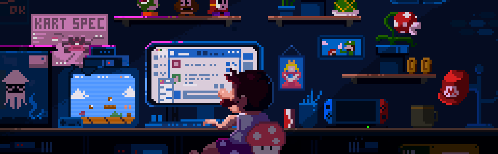

## Hi there, I am Tatyana Egorenkova! 

__Technology stach__ 
_Languages and technologies_ 
     

_Tables and databases_ 
    

_Additional tools_ 
    

_Machine learning_ 
     

_Neural Networks and Computer vision_ 
    

---
#Contacts 

